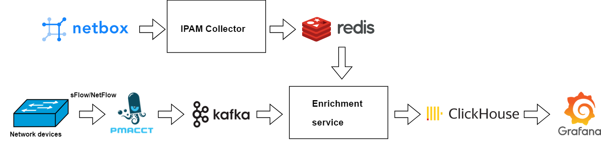

# sFlow data enrichment example

Basic implementation of sFlow data enrichment.
Made for testing purposes.

Implementation of the following scheme with Docker Compose:

Netbox deployment in containers: https://github.com/netbox-community/netbox-docker

More details in the article: https://www.linkedin.com/pulse/sflow-data-enrichment-timur-iskenderov-yod8e
